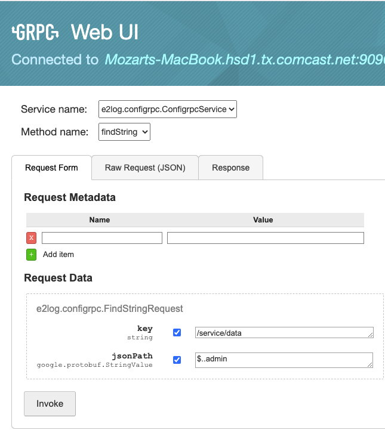
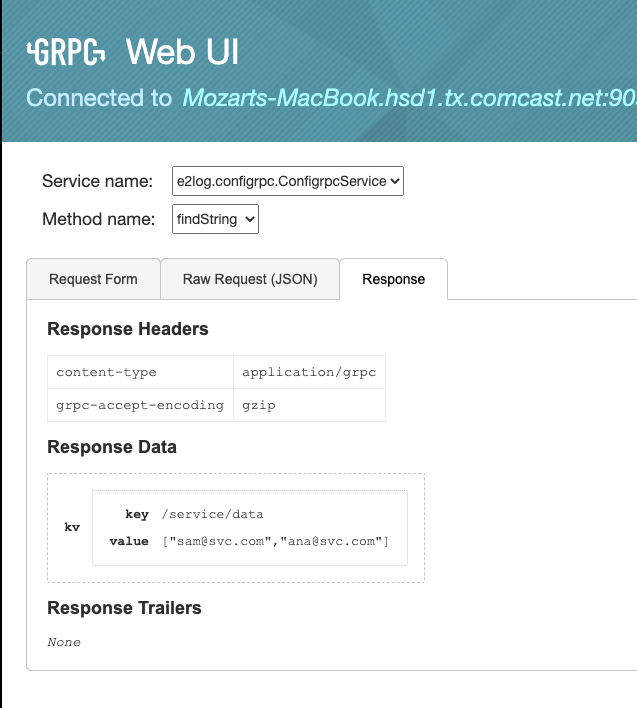

# ConfigRPC
A Distributed Configuration Service Based on gRPC


This the Configrpc Service Server component based on [gRpc](https://grpc.io/docs/guides/), it depends on the interface `configrpc-api.jar`  


## How do I get set up? ###
 
- java 11 or newer 

## Install the dependency `configrpc-api.jar` locally, see project for install details 


## Run
`./mvnw spring-boot:run`

Note: this project uses Google protocol buffers

## Run gRPC UI using docker

- todo

## Sample JsonPath queries:

- Given the following config data
```json
{
  "environments" : [
    {
      "environment": "TEST", 
      "database": {"host": "10.0.0.79", "user": "sa", "password_key": "test-db-pwd"}, 
      "admin": "sam@svc.com"
     },
    {
      "environment": "STAGING",
      "database": {"host": "10.1.0.237", "user": "sa", "password_key": "staging-db-pwd"},
      "admin": "ana@svc.com"
    }
  ]
}
```
- Query 1: All database properties of 1st environment

    key : `/service/data` 

    jsonPath : `$.environments[0].database`
    
  Returns:
 `{host=10.0.0.79, user=sa, password_key=test-db-pwd}`
  
  
- Query 2: The host property of the database of 1st environment 

    key : `/service/data` 
   
    jsonPath : `$.environments[0].database.host`
    
  Returns:
 `10.0.0.79`
  
  
- Query 3: The property admin of all the database configurations

    key : `/service/data` 
   
    jsonPath : `$..admin`
    
- Returns:
 `["sam@svc.com","ana@svc.com"]`

All admins JsonPath query:   
 
  
  
All admins result:  
 

